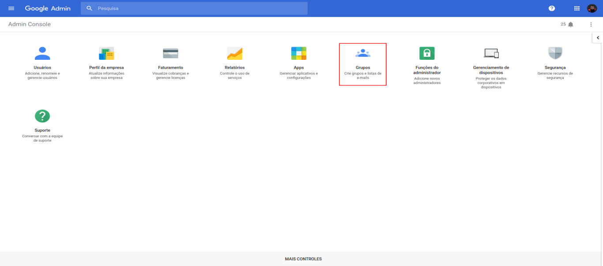
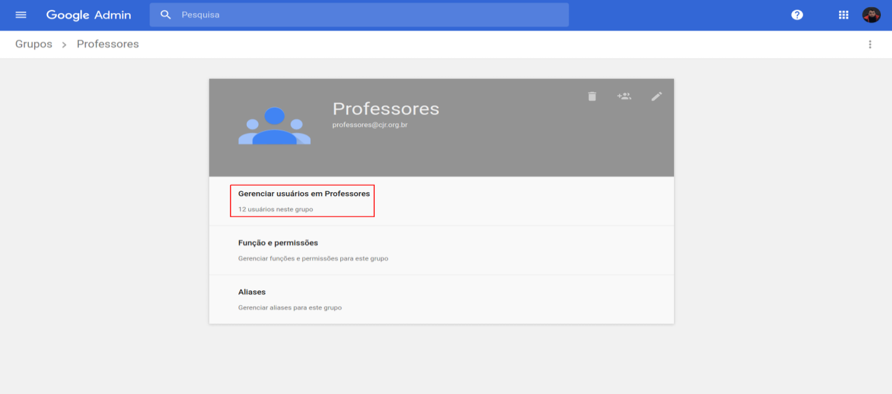
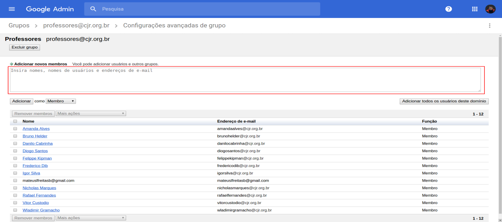
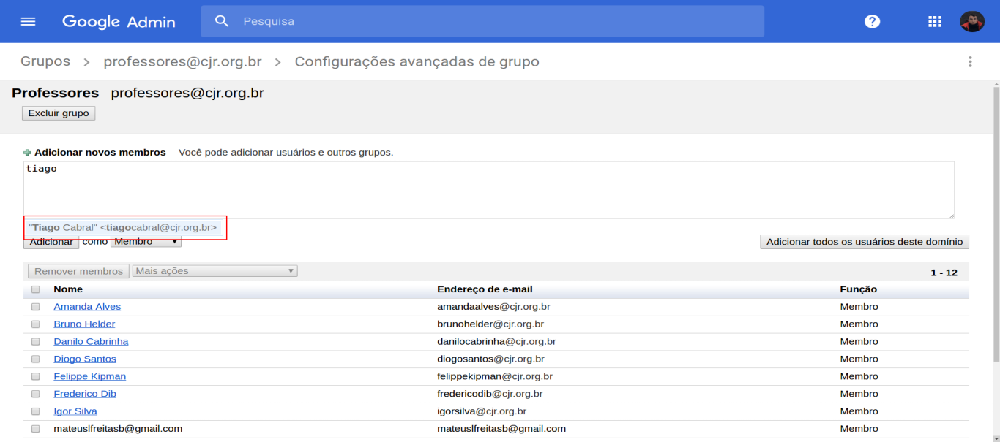

# Processo de Adição de Monitores ao grupo do Gmail

Para realizar este processo o membro deve ter acesso de administrador das contas da CJR. Ele deve requisitar ao Líder de Desenvolvimento e Pesquisa esse acesso.

### Dados necessários

Para adicionar um membro ao grupo de monitores (professores@cjr.org.br), precisamos do nome ou email do membro.

### Acessando a página de Grupos

Acesse [o painel de administração do Google Suite](http://admin.google.com), vá em **Grupos**.

### Página de Professores

Clique em **Professores**.

Clique em **Gerenciar usuários em Professores**

### Adicionando monitores

Para adicionar monitores, digite no campo **Adicionar novos membros** indicado abaixo, o nome ou o email do monitor.

Enquanto estiver digitando o Gmail irá sugerir uma opção para autocompletar como indicado abaixo. Clique nesta opção como indicado e o Gmail irá autocompletar com a formatação adequada.

**Importante:** atente-se para deixar o seletor ao lado na opção **Membro** **antes** de clicar no botão adicionar.

Depois que todos os monitores tiverem sido adicionados, basta clicar no botão **Adicionar** para salvar as modificações.
