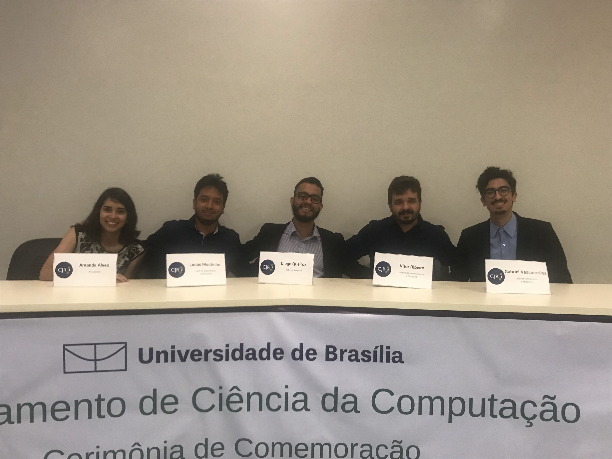
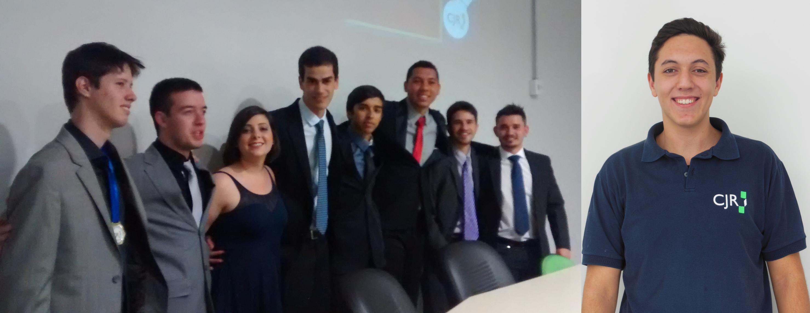

# Histórico Gestões

## GESTÃO 2018

**Presidente:** Amanda Oliveira Alves

**Líder de Talentos:** Diogo Queiroz dos Santos

**Líder de Organização Empresarial:** Lucas da Silva Moutinho

**Líder de Desenvolvimento e Pesquisa:** Vitor Ribeiro Custodio

**Líder de Atendimento e Marketing:** Gabriel Correia de Vasconcelos

## GESTÃO 2017

**Presidente:** Wladimir Ganzelevitch Mesquita Gramacho

**Líder de Talentos:** Bruno Helder Rodrigues

**Líder de Organização Empresarial:** Frederico Pinheiro Dib

**Líder de Desenvolvimento e Pesquisa:** Rafael Alves Fernandes

**Líder de Atendimento e Marketing:** cargo em vacância

## GESTÃO 2015/16

**Presidente:** Renan Rocha Reboredo

**Líder de Desenvolvimento e Pesquisa:** Rodrigo de Araujo Chaves

**Líder de Organização Empresarial:** Vitor Passos Pontes

**Líder de Atendimento e Marketing:** Rafael Dias Silveira

**Líder de Talentos:** Afonso Dias de Oliveira

## GESTÃO 2014/15

**Presidente Institucional:** Cristiano Ribeiro dos Santos

**Diretor de Comunicação:** Rodrigo de Araujo Chaves

**Diretor de Negócios:** Renan Lobato Rheinboldt

**Presidente Organizacional:** Carlos Joel Tavares da Silva

**Diretor de Talentos:** Lucas Mafra Chagas

**Diretor de Tecnologia da Informação:** Arthur Pucci de Sousa

**Diretor de Administrativo e Financeiro:** Mateus Nogueira Brumano

**Diretor de Projetos:** cargo em vacância

## GESTÃO 2013/14

**Diretor de Projetos:** Thiago Santaguida Magalhães de Souza

**Diretor de Negócios:** Heitor Henrique de Paula Moraes Costa

**Presidente Organizacional:** Julia Gonzalez Azevedo Pinheiro Soares Macedo

**Diretor de Administrativo e Financeiro:** Allisson Matheus de Rezende Barros

**Diretor de Comunicação:** Matheus Moretti Rangel / Renan Rocha Reboredo

**Diretor de Talentos:** Rocha

**Diretor de Tecnologia da Informação:** Ícaro Araújo Dantas

**Presidente Institucional:** Thales Moreira Vinkler

## GESTÃO 2012/13

**Presidente Institucional:** Arthur de Azevedo Braga

**Presidente Organizacional:** Rafael Scofield Sardenberg

**Coordenador de Projetos:** Felipe Rodopoulos

**Diretor de Finanças e Negócios:** Pedro Vítor Falcetti Sozin

**Diretor de Talentos:** Hermano Portella Leite

**Diretor de Tecnologia da Informação:** Jaqueline Couto Moreira

**Diretor de Comunicação:** cargo em vacância

## GESTÃO 2011/12

**Presidente Institucional:** Paulo Ricardo Giusti \(Pauleta\)

**Presidente Organizacional:** Renato Leal \(Cata\)

**Diretor de Relações Externas \(Comunicação\):** Matheus Parreiras

**Diretor de Finanças e Negócios:** Estêvão Aguiar

**Diretora de Talentos:** Naiara Watanabe

**Diretor de Tecnologia da Informação:** Mateus Antunes / Lucas Shimabuko

## GESTÃO 2010/11

**Presidente Institucional:** Pricila Rodrigues Gomes \(Pri\)

**Presidente Organizacional:** Lucas Lo Ami \(Pips\)

**Diretor de Relações Externas \(Comunicação\):** Vinicius Tafuri Carvalho \(Tafuri\)

**Diretor de Finanças e Negócios:** Estêvão Aguiar

**Diretora de Talentos:** Paulo Ricardo Giusti \(Pauleta\)

**Diretor de Tecnologia da Informação:** Renato Leal \(Cata\)

