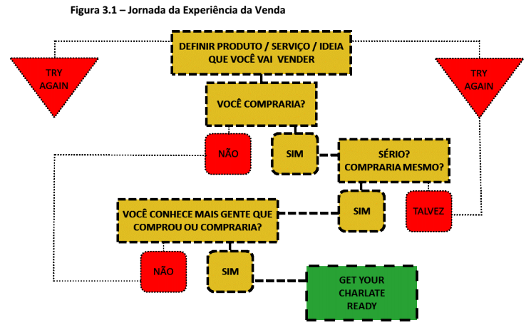
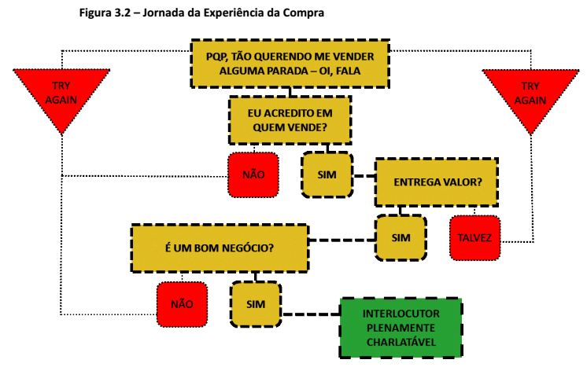

**_Disclaimer_: Este conteúdo foi criado pela Look'n Feel, empresa de Publicidade de Brasília.**

### O QUE É CHARLATE

**Definição:**
É a genuína [re]criação da verdade feita para um local, momento e CPF específicos.

**Manifesto:**
É contar uma história. Não estória, nem mentira. É o capricho da sua verdade, na sua melhor versão, para um interlocutor único, na hora certa. É uma narrativa *sexy*, dessas que a gente se envolve, com início, meio e fim. É preparar o terreno, chegar de mansinho e respeitar o *timing* das conexões. São as preliminares do negócio, o *unboxing* da ideia e toda jornada percorrida até a hora H. Quem charlata traz o ouvinte pra brincadeira, dança com o interlocutor, e à medida que fala, escuta com atenção pra não perder o compasso.

#### O CHARLATE DO EXTREMO OPOSTO
Muitas vezes, procuramos diversas formas de passar a mensagem para o interlocutor e temos um sentimento de que, por mais assertivos que sejamos na escolha das palavras, a mensagem não é passada por completo. Uma boa alternativa em casos como esses é fazer uso do extremo oposto, ou seja, surpreendemos o interlocutor com uma mensagem tão extrema que finalmente conseguimos passar a mensagem inicial de um jeito inesperado.

#### O PROCESSO DE VENDA
O processo de venda, para que aconteça com sucesso, depende de basicamente duas etapas:

1. **Pré Charlate:** Definição de um produto / serviço que gere verdadeiro valor ao comprador; (a NDP é responsável por capacitar pessoas para poder fazer isso)

2. **Charlate:** Processo de convencimento do interlocutor para fechamento da venda.

Para a validação da etapa de **Pré Charlate** do processo de venda, é importante percorrer o fluxo de jornada básica da venda chegando até o final do processo. Embora seja uma visão extremamente importante, o fluxo de venda por si só, ainda que muito bem feito, não garante o sucesso no processo. É importante também considerar que, para cada jornada de venda percorrida, existe um interlocutor que passará por uma jornada de compra. Essa percepção é igualmente importante pois da mesma forma que no fluxo da jornada de venda, a jornada de compra também passa por um fluxo que se não for planejado poderá acabar inviabilizando aquele negócio.

Para cada segmento de produto / serviço, é possível que existam sutis alterações ao longo dessas jornadas que deverão ser percebidas e planejadas. De maneira genérica, as jornadas de venda e compra podem ser resumidas nos fluxos abaixo:

	

	

Passados os dois fluxos anteriores, está vencida a etapa do Pré Charlate, chegando finalmente na etapa do Charlate. Essa etapa deverá ser igualmente planejada para que dê certo e o passo a passo pode ser descrito através de 5 perguntas:

1. **Porque você está realmente convencido?**
	Para que seja possível convencer qualquer pessoa de qualquer coisa, é essencial que você esteja realmente convencido e, principalmente, que você conheça todos os motivos que podem levar alguém a pensar diferente. Mapeados esses motivos, é importante que o vendedor faça o exercício de empatia de se colocar no lugar do comprador e procure entender sob o ponto de vista dele cada motivo que possa impedir aquela venda. Se ainda assim o comprador não estiver convencido, talvez seja até um melhor negócio não realizar aquela venda, pois o foco é vender para quem compartilhe das mesmas crenças de quem está vendendo.

	**Referência 3.1**

	[TED Talks – Simon Sinek – The Golden Circle](https://www.youtube.com/watch?v=u4ZoJKF_VuA "TED Talks – Simon Sinek – The Golden Circle")

2. **Você realmente entende sobre a parada?**

	O processo de compra, do ponto de vista do comprador, só acontece quando o serviço supre uma necessidade real que justifica aquela transação. Para mapear e materializar as necessidades do comprador, é essencial que o vendedor saiba fazer as perguntas certas de forma a conscientizar o comprador daquela necessidade que muitas vezes ainda não foi nem percebida. Fazendo boas perguntas, o próximo passo é ter repertório que possa conectar as respostas do comprador aos atributos de valor do produto / serviço, o levando a perceber que o objeto da venda é uma solução para ele.

	**Importante:** repertório é resultado de trabalho e esforço acumulados. Para dobrar o repertório de qualquer vendedor, uma boa prática em vendas é sempre executar o processo em duplas. Assim, a cada momento que falte repertório em um da dupla, o outro poderá suprir aquela necessidade. Além do repertório incremental, a venda em dupla também incentiva a ambos que o processo seja muito bem feito pois acaba sendo um momento de avaliação mútua e aprendizado comum.  

3. **Você conhece o seu interlocutor e fala a língua dele?**

	A máxima popular descreve toda história como tendo 3 versões: a minha, a sua e a verdade. De fato, é particular ao ser humano a capacidade de interpretar os fatos e construir a sua verdade a partir dessas interpretações. Entendido este ponto, é essencial ter o entendimento do interlocutor de o que é valor pra ele. O valor (benefício) em um processo de venda é muito diferente para o vendedor e para o comprador. Enquanto o benefício do vendedor é a transação em si, o benefício do comprador é o resultado dessa transação, e é exatamente este o ponto que o vendedor deve explorar. Quando o vendedor não consegue discutir valor com o comprador, o comprador vai querer discutir preço.

	Dado que o processo de venda seja feito em duplas, é importante que cada um da dupla possa assumir um papel no processo. Uma divisão de papéis que faz bastante sentido é a lógica de “good cop” e “bad cop” ou “charme” e “funk”. O good cop ou o charme é aquela pessoa querida, que quer fazer as vontades do interlocutor, está sempre preocupado em atender as demandas dele. Do outro lado, o bad cop ou funk, é aquela pessoa mais pragmática, mais dura na negociação e que oferece bem menos flexibilidade ao interlocutor. Como cada comprador é único, em cada processo de venda a dupla deverá entender qual a melhor abordagem e o qual o real valor do comprador no processo.  

4. **Você tem a confiança do seu interlocutor?**

	A confiança do interlocutor é uma condição básica para tornar a venda possível. Para ganhar a confiança do interlocutor, o vendedor poderá fazer uso da sua história, credibilidade, rede pessoal e profissional, cases, etc. É sempre importante planejar pelo menos 2 gatilhos (plano A e plano B) para conquistar a confiança do interlocutor e procurar usar esses gatilhos nos melhores momentos possíveis.

	**Referência 3.2**

	Livro – A Imagem Revelada – Olga Curado

	**Referência 3.3**

	[TED Talks – Onora O’Neill – What We Don’t Understand About Trust](https://www.youtube.com/watch?v=1PNX6M_dVsk)

5. **Consegue explicar sua ideia em 1 tweet?**

	A capacidade de síntese ao explicar / vender qualquer ideia diz muito sobre o entendimento daquela ideia. Quando precisamos de muito mais que 1 tweet (140 caracteres) para discorrer a respeito de uma ideia, provavelmente a ideia não está tão clara na nossa cabeça. Para vender uma ideia em um formato curto, existe uma construção básica que poderá ajudar bastante:

<strong> EVIDÊNCIA + AÇÃO + BENEFÍCIO </strong>

#### A MATRIZ DO CHARLATE

	

