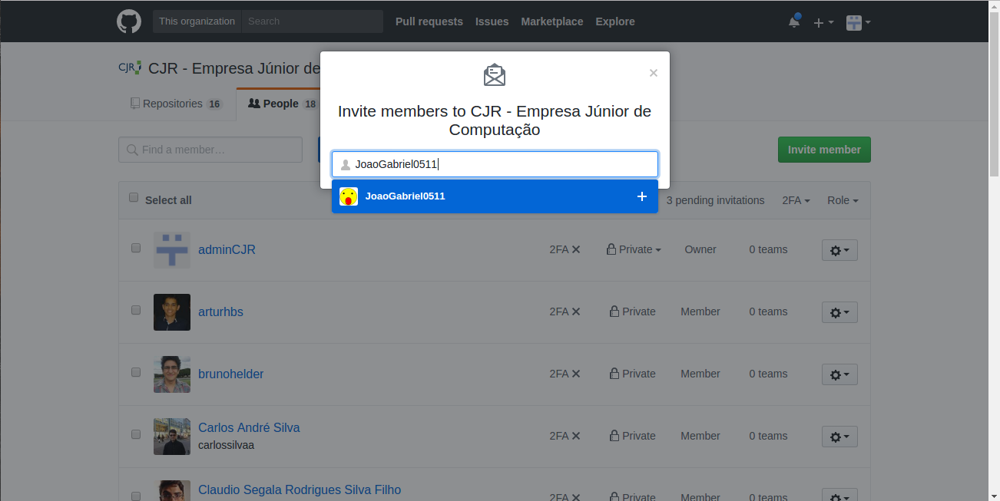

# 2.6 Gestão do Github

A cjr possue uma conta de organização no github com o nome de usuário 'unbcjr'.

Semestralmente devem ser removidos da organização os membros que sairam e adicionados membros que entraram.

Para realizar este processo o membro deve ter acesso de administrador das contas da CJR. Ele deve requisitar ao Líder de Desenvolvimento e Pesquisa esse acesso.

## Repositorios

Os repositorios da cjr se encontarm em '[https://github.com/unbcjr](https://github.com/unbcjr)'.

Atualmente ela possue 16 repositorios, eles são:

* playbook
* site
* ps
* ndp
* projeto\_base
* product\_backlog\_maker
* sap
* base\_rails\_project
* slidespt
* sga
* learning
* sgp
* psurprise
* scrum\_master\_course
* ruby\_course
* rails\_course

## Adição e exclusão de membros

Primeiro é necessário logar no github com a conta do administrador da cjr \('admin@cjr.org.br'\). Quando estiver logado selecione a aba escrito 'adminCJR', selecione entre as opções que aparecerão 'Manage organizations'.

Você será levado então para a pagina de Gestão de organizações do admin. No caso haverá apenas uma organização selecionavel a cjr, selecione-a.

Depois será levado para a pagina de perfil da cjr, escolha a opção 'People' que será mostrado todos os membros afiliados a organização.

Para excluir um membro basta abaixar a pagina até encontrar o membro desejado e clicar no botão de opções, depois selecione a opção em vermelho "Remove from organization", logo após será aberta uma janela onde se derverá confirmar a exclusão apertando o butão "Remove members".

Depois disso a pagina será recarregada com uma mensagem no topo informando que a remoção do membro levará alguns minutos para proceder.

Caso queira excluir-se mais de um membro, basta clicar na check list do lado de cada membro desejado, selecionar a aba do topo e clicar em "Remove from organization" e repetir o resto do processo para um membro listado anteriormente.

Para adicionar-se um membro escolha a opção do topo da pagina "Invite member".

Depois disso uma janela vai abrir pedindo que informe o nome, o nome de usuario ou o email da pessoa desejada. Se a conta existir no sistema ela vai aparecer numa listagem abaixo, selecione-a.

Você será levado então para uma pagina pedindo para confirmar a senha da conta do admin.

Depois disso aparecerá uma tela para confirmar a opreção, caso esteje adicionando um membro que tenha sido previamente excluido aparecerá a opção de reestabelecer os privilégios que o membro detinha, de qualquer forma para confirmar basta clicar no botão no final da pagina "Invite"\(no caso de membros previamente deletados "Invite and reinstate" ou "Invite and start fresh"\).

Depois você será redirecionado para a pagina de perfil com uma mensagem no topo informando que um convite foi enviado para o email da pessoa, depois disso basta esperar a pessoa aceitar e ela será adicionada aos membros da organização.

