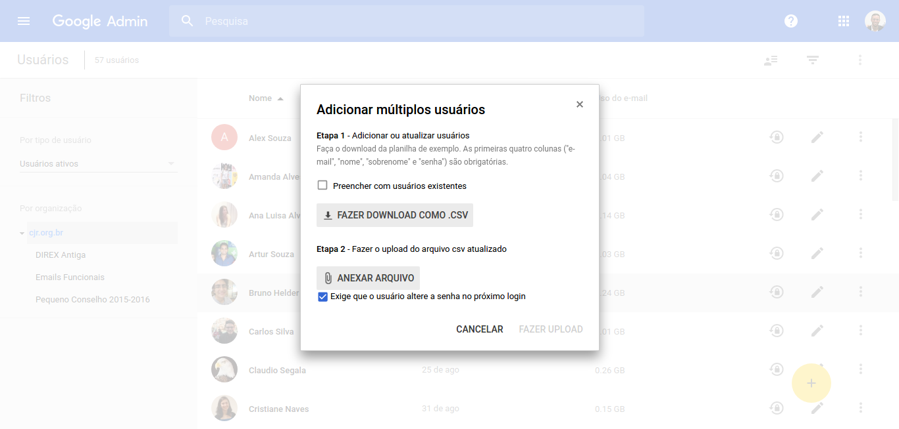

# Processo de Criação de Email

Para realizar este processo o membro deve ter acesso de administrador das contas da CJR. Ele deve requisitar ao Líder de Desenvolvimento e Pesquisa esse acesso.

### Dados necessários

Para a criação do email do trainee ou membro é necessário seu nome completo.

O formato padrão do email é `nomesobrenome@cjr.org.br` e o nome do usuário da conta é `Nome Sobrenome`.

### Formulário de criação

Acesse [o painel de administração do Google Suite](http://admin.google.com), vá em **Usuários**, passe o mouse sobre o botão amarelo.

### Único usuário

Para a criação de apenas um usuário, clique em **Adicionar usuário**.

Preencha o nome, o sobrenome e o email como indicado acima. A senha deve ser preenchida como `nomesobrenome123`.

Clique em **Criar**.

### Múltiplos usuários

Para a criação de múltiplos usuários, clique em **Adicionar múltiplos usuários**.

Baixe a planilha `.csv` de exemplo e preencha como indicado acima. A senha deve ser preenchida como `nomesobrenome123`.

Clique novamente em **Adicionar múltiplos usuários** e faça upload da planilha preenchida. Deixe a opção **Exige que o usuário altere a senha no próximo login** marcada. Clique em **Fazer upload**.

Você receberá um email com o relatório de criação dos emails.

**Importante:** caso os emails sejam de trainees, imprima a tabela.